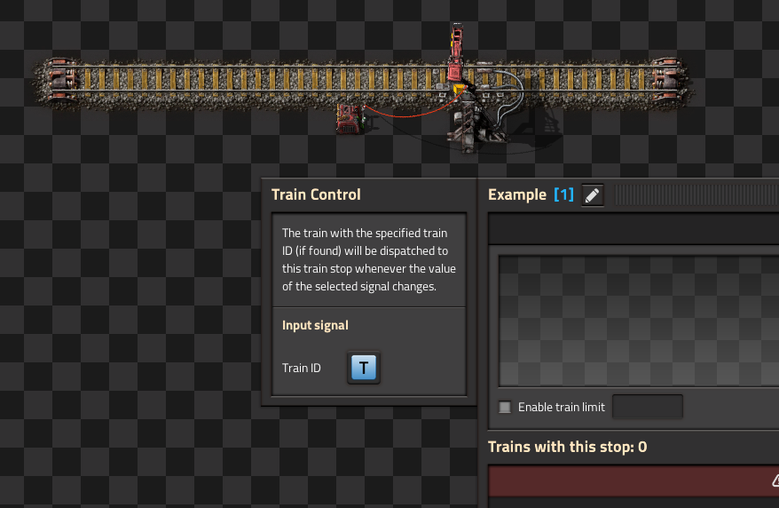

# Train Control

Allows you to dispatch a train to a specific train stop (not just by name, one specific train stop) by sending its train ID to that train stop via the circuit network.

### Waiting conditions

There's no support for custom waiting conditions as of now (because I haven't thought of a logical way to represent waiting conditions via circuit network signals yet), so instead the train will receive the following pre-defined waiting conditions:
* 5 seconds of inactivity; OR
* The 'check' signal is non-zero.
